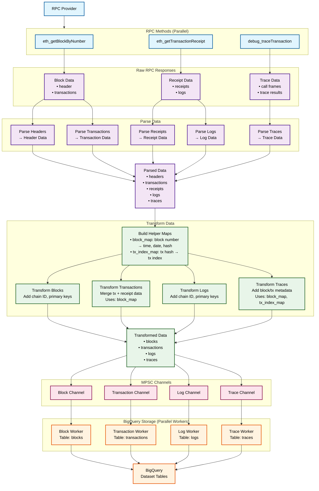

# Blockchain Indexer

## Description

The Blockchain Indexer processes blockchain data from various EVM-compatible chains.
Features include:
- Continuous processing of blockchain data with configurable delay from chain head
- Performant historical backfills (tested at >150 blocks/sec)
- Support for multiple EVM chains including Ethereum and ZKSync

> ⚠️ **Note**: BigQuery only supports partitioned tables with a maximum of 10 years of history. Therefore, it is not recommended to use this indexer for Ethereum with the current (daily) partitioning setup.


## Prerequisites

### Required Software
- **Rust 1.85+** - [Installation guide](https://rustup.rs/)
- **Cargo** - Comes with Rust installation
- **Docker and Docker Compose** - [Installation guide](https://docs.docker.com/get-docker/)

### Environment Setup
- Set up GCP credentials: `gcloud auth application-default login`
- Ensure your RPC provider supports: `eth_getBlockByNumber`, `eth_getTransactionReceipt`, `debug_traceTransaction`

## Indexer Configuration
The indexer is configured through a single `config.yml` file. To get started:

1. Copy the example configuration file:
```bash
cp config.yml.example config.yml
```

2. Edit `config.yml` with your settings:
- **Chain Settings**: 
  - `chain_name`: The blockchain to index (e.g., "ethereum", "zksync"). This name is used for BigQuery dataset naming.
  - `chain_tip_buffer`: Number of blocks to stay behind the chain head to avoid issues with chain reorgs.
  - `start_block`: (Optional) The block number to begin indexing from. If omitted or set to 0, and if `end_block` is also 0 or omitted, the indexer will attempt to find the last processed block in BigQuery and resume from there. If no prior data exists, it starts from block 0.
  - `end_block`: (Optional) The block number to stop indexing at. If omitted or set to 0, the indexer will run continuously, processing new blocks as they appear on the chain (respecting `chain_tip_buffer`).
- **RPC**: 
  - `rpc_url`: URL for your blockchain node (e.g., "https://eth.drpc.org"). Ensure your provider supports the necessary RPC methods (like `eth_getBlockByNumber`, `eth_getTransactionReceipt`, `debug_traceTransaction`, etc., if tracing is enabled).
- **BigQuery Dataset Location**:
  - `dataset_location`: The GCP region where your BigQuery datasets will be created (e.g., "us-central1", "europe-west2").
- **Datasets**: Choose which data types to index:
  - `datasets`: A list of strings specifying the data types to collect. Options include:
    - "blocks"
    - "transactions"
    - "logs"
    - "traces"
- **Metrics**: 
  - `metrics`: Configuration for Prometheus metrics.
    - `enabled`: Set to `true` to enable the metrics server, `false` to disable.
    - `address`: The IP address the metrics server will bind to (e.g., "0.0.0.0" for all interfaces).
    - `port`: The port for the metrics server (e.g., 9100).

The actual `config.yml` file is excluded from version control. See `config.yml.example` for a template with all supported options.

## Deployment Options

### 1. Local Rust Setup
Run directly on your machine using Cargo:
```bash
# Clone repository
git clone https://github.com/lgingerich/blockchain-indexer.git
cd blockchain-indexer

# Build and run in development mode
cargo run

# Build and run with optimizations
cargo run --release
```

### 2. Local Docker Setup
Run the indexer using Docker Compose:

```bash
# Clone repository
git clone https://github.com/lgingerich/blockchain-indexer.git
cd blockchain-indexer

# Start the indexer
docker compose up

# Start the indexer with a config file at a custom path
CONFIG_SOURCE=path/to/your/other-config.yml docker compose up
```

## Data Schemas
The indexer creates BigQuery tables with schemas that vary by chain type. Each dataset (blocks, transactions, logs, traces) has a base schema with chain-specific extensions.

### Schema Selection
- **Chain ID Mapping**: Chain IDs are mapped to schemas in `src/models/common.rs`
- **Default Schema**: Unknown chains default to Ethereum schema
- **Schema Location**: In-process schemas are defined in `src/models/datasets/` and BigQuery schemas are defined in `src/storage/bigquery/schema.rs`

### Schema Extensions
To add support for new chains:

**For chains using existing schemas (e.g., ZKsync variants):**
1. **Add Chain ID**: Update the `from_chain_id` function in `src/models/common.rs`

**For chains requiring new schemas (e.g., OP Stack, Arbitrum):**
1. **Add Chain ID**: Update the `from_chain_id` function in `src/models/common.rs`
2. **Create Data Models**: Add chain-specific structs in `src/models/datasets/`
3. **Update Schema**: Add chain-specific fields in `src/storage/bigquery/schema.rs`
4. **Add Parsing Logic**: Implement parsing in `src/indexer/rpc/` modules
5. **Add Transformations**: Implement transformations in `src/indexer/transformations/`

## Architecture


## Metrics and Logging

### Metrics
- **Endpoint**: `http://localhost:9100/metrics` (Prometheus format)
- **Health Check**: `http://localhost:9100/health`
- **Key Metrics**: Blocks per second, RPC latency, BigQuery performance

### Logging
- **Level**: Set via `RUST_LOG` environment variable (default: info)
- **Output**: Structured logs to stdout/stderr
- **Backtraces**: Enable with `RUST_BACKTRACE=1`

## Development

### Testing
```bash
# Run all tests
cargo test

# Run tests with output
cargo test -- --nocapture
```

### Building
```bash
# Development build
cargo build

# Release build
cargo build --release
```

## License

This project is licensed under the MIT License - see the [LICENSE.md](LICENSE.md) file for details.